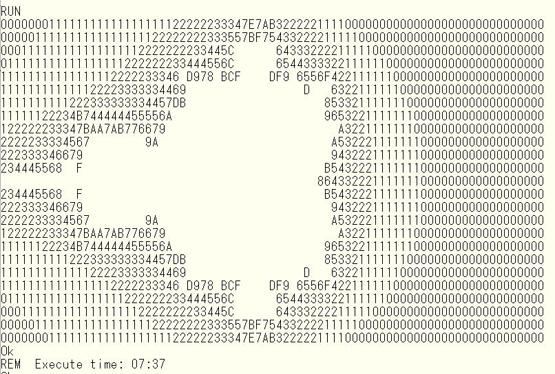
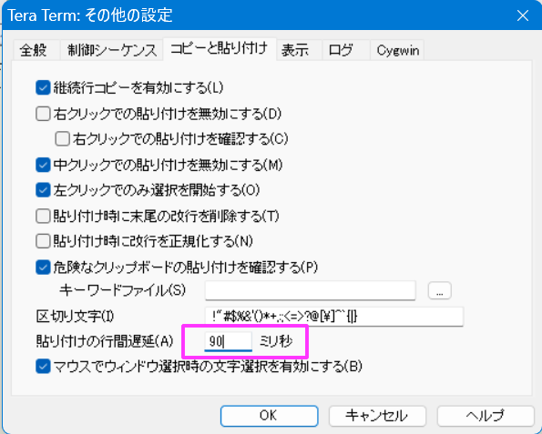
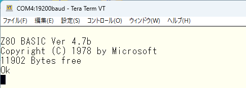
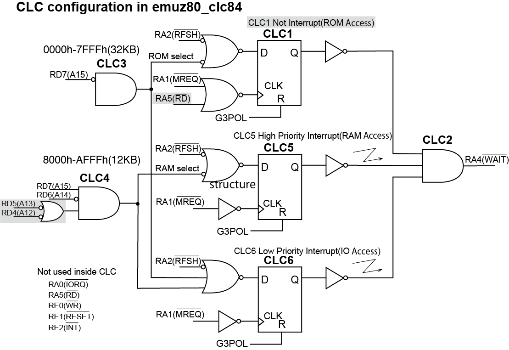
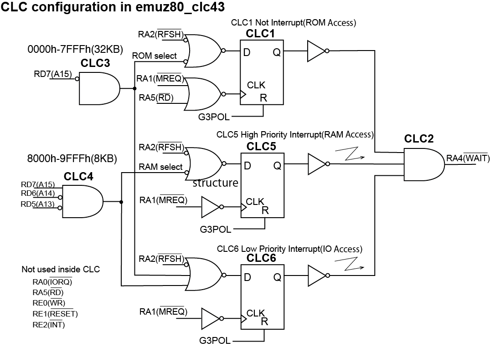
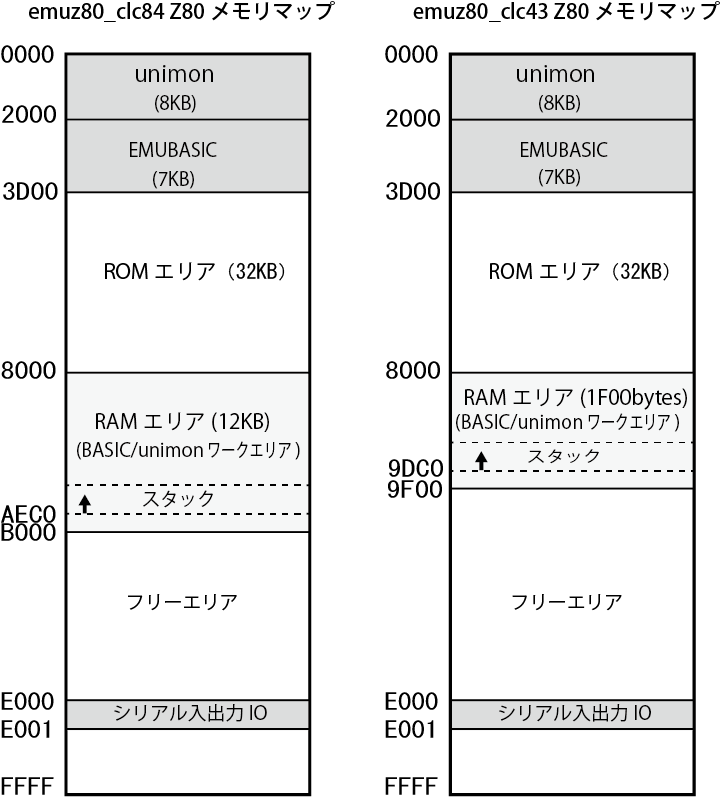
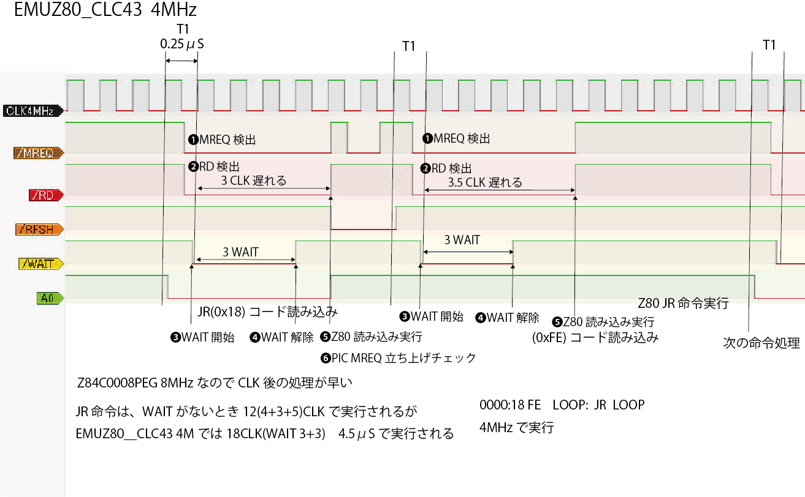
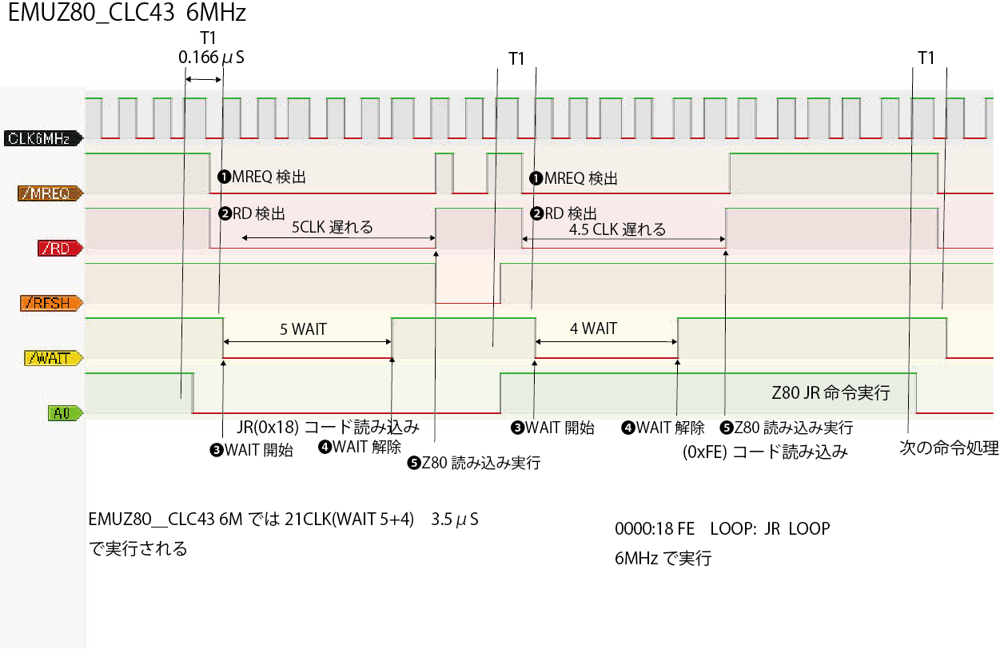
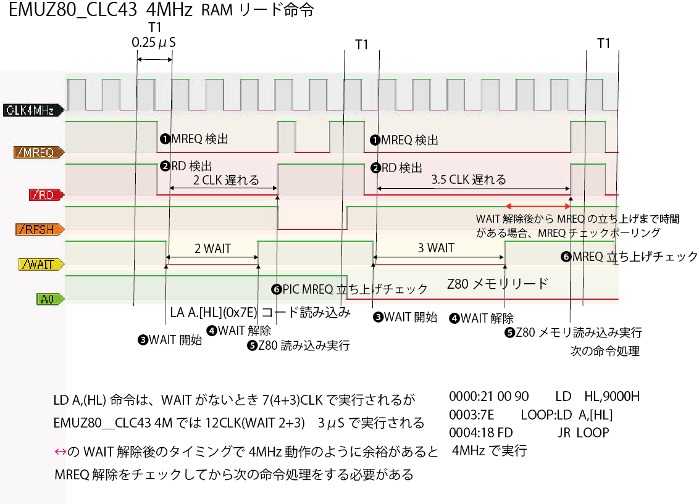

# EMUZ80_yyhayami
EMUZ80 firmware modify by yyhayami

電脳伝説さん(@vintagechips)の作成・発表されたPIC18FによるZ80 ROM/RAM/IOエミュレーションシステムであるEMUZ80をMCC(MPLAB Code Configurator)/CLC(Configurable Logic Cell)化して高速化したバージョンを2022年4月に作成・発表しました。
<figure>
    
    <figcaption>EMUZ80マイコンボード</figcaption>
</figure>

その後、
Gazelle(@Gazelle8087) さん　によるROMポーリング処理とCLC改良による高速化
Aki.h(@akih_san)さん　によるMONITOR及びTinyBASIC,GAME80などの機能拡張
奥江 聡(@S_Okue)　によるRAM IC化及び Z180等の他CPU対応拡張基板
他多くの方の尽力により、EMUZ80はさらに優れたエミュレーションシステムへと発展しました。

そこで、EMUZ80ファームウェアの機能拡張を以下のように整理してみました。
- GazelleさんのROMポーリング処理を採用して高速化
- PIC18Fの種類によりメモリの最適化を図り、ROM/RAM使用サイズ拡大
- Aki.hさんが機能拡張したunimonを組み込み、起動時はモニタから自動でEMUBASIをC起動
- 動作速度の向上を生かして、シリアル通信速度を19200bpsへ高速化(フロー制御なし)

ASCIIARTは、7:37(PIC18F47Q43 Z80 6MHz)で実行します。最速ではありませんがかなり高速に動作します。
<figure>
    
</figure>
ROM/RAM/IO リード時にPICのデータバスは出力になりますが、通常はINPUT状態にしてあります。
(EMUZ80の初期のファームウェアではMREQ復帰の割り込み処理でINPUTに戻している)

--- 
## emuz80_clc84
PIC18F47Q84に変更することで、RAMを12Kバイトに拡張しています。
BASICが立ち上がると11902 bytesのフリーエリアが表示されます。

### emuz80_clc84.hex
Z80の動作は6MHzに最適化されています。

### emuz80_clc84_4M.hex
Z80を4MHzで動作させます。
レトロPCで使用されていたZ80CPU等を使う場合はこちらのファームウェアを使用してください。MZ-80に搭載されていた SHARP LH0080A Z80A 4MHz で動作を確認しています。

---
## emuz80_clc43
PIC18F47Q43用で、RAMを8Kバイト弱(7936bytes)で動作します。
BASICが立ち上がると7806 bytesのフリーエリアが表示されます。
### emuz80_clc43.hex
Z80 6MHzで動作します。
Z80 CPUはCMOS版のZilog Z84C000xPEGの使用を前提にしています。
### emuz80_clc43_4M.hex
Z80 4MHzで動作します。

---
## 使用方法
1. PICKiT4等の書き込み装置を使ってファームウェアをPICへ書き込む
1. 電源アダプタ、USB変換シリアルケーブルを接続
1. Windows等におけるTeraTerm等の端末ソフトウェアの通信速度を19200bpsに設定
1. EMUZ80上のスイッチをON

TeraTermの使用時には、BASICプログラムのCopy/Pasteを行うために、その他の設定→貼り付けの行間遅延を90ミリ秒に設定
<figure>
    
</figure>

BASICが起動して、フリーエリアサイズが表示されます。ここでBASICのコマンド操作が可能になります。

<figure>
    
</figure>
MONITOR  と入力 することで unimonの動作になり、プロンプトでモニタ操作ができます。
```
]#L
```

 #Lコマンドで起動リストが表示され

```
]#1
```

 #1でBASICがコールドスタート、#2で入力したプログラムを残したままでウォームスタートします。
```
]G 2000
```
G コマンドではアドレスに2000を入れることでBASICに戻ることができます。

---
## CLC構成
CLCを6個使うことで、ROMアクセス、RAMアクセス、IOアクセスの3種類の高速チェックを行います。
RAMアクセスとIOアクセス処理は割り込み処理を、ROMリードはポーリング処理でCLC1の出力信号をチェックしています。
RAMアクセスとROMリード処理はシンプルで単機能なため、PIC18インラインアセンブラで記述して高速化を図っています。
<figure>
    
    <figcaption>EMUZ80_CLC84論理回路図</figcaption>
</figure>
ROMリード、RAMアクセス、IOアクセスのいずれかの処理が要求された場合はCLC2の出力からすぐにWAIT信号が出力されます。
ROMリードをチェックするCLC1は、D-FFのCLK入力を/MREQ　→　/MREQ と /RD の AND入力(負論理信号のNAND)に変えて ROMにライト処理が行うことを防ぐよう変更しています。
ROMのアドレスチェックにCLC3を使用していますが、32KBサイズの ROM のチェックではA15のみのチェックで良いため、CLC3を使わずに直接入力することが可能ですが、他のアドレス配置でも対応できるようCLC3を使用したままにしてあります。
RAMのアドレスチェックは、CLC4を駆使して Z80上で0x8000～0xAFFF に配置されたとエミュレートした 12KB のRAMアクセスチェックを行っています。
IOアクセスは、ROM,RAM以外のアドレスのチェックをCLC6で行い、CLC6の割り込み処理内でメモリマップド(0xE000,0xE001)のチェックを行いシリアル入出力を行います。
<figure>
    
    <figcaption>EMUZ80_CLC43論理回路図</figcaption>
</figure>

---
## メモリマップ
EMUZ80_CLC84とEMUZ80_CLC43のZ80におけるメモリ配置を示します。
<figure>
    
    <figcaption>メモリマップ</figcaption>
</figure>
PIC18F47Q84 はPICのレジスタ以外に使用できるRAMサイズが12KBを若干越えますが、PIC18F47Q43は8KBを少し下回ります。
EMUZ80_CLC43 では、RAMアクセスのCLC4の設定以外は、CLC84と同じです。CLC4により0x8000～0x9FFFのエリアアクセスチェックを行っていますが、PIC上のRAMサイズは少し8KBに届かないのですが、Z80 上で動作するプログラムで調整しています。
ROMエリアはPIC内蔵のFlash ROMで32KBは十分確保できます。
RAMエリアを使用するスタックエリアは、CLC84では 0xAEC0 から、CLC43は 0x9DCからアドレス低エリアへ広がっていきます。

---
## タイミングチャート

####4MHz ROMリード　(JR LOOP)
emuz80_clc43_4Mによる Z80 のコントロール信号をロジック・アナライザで測定すると以下のようになります。
<figure>
    
    <figcaption>EMUZ80_CLC43_4Mタイミングチャート</figcaption>
</figure>
一番上のCLK4MHzが動作クロックであり、1サイクルは0.25μSになっています。動作クロックはTサイクルとも呼ばれ最初のサイクルはT1となります。
レジスタ間転送などの1バイト命令では、WAITがないときT1～T4までの4サイクルで1命令が実行され、これを１マシンサイクルと呼びます。
このタイミングチャートは、

```
0000:18 FE  LOOP: JR LOOP
```
を実行している状態です。
- 命令コード(0x18)をリード
  - MREQとRD信号の立ち上がりでコードを読み込むので、PICがそのデータを用意するまでWAITを挿入する必要があります
  - WAITは3クロック長入っています
- オペランド(0xFE)をリード
  - WAITは同じく3クロック長入ります
JR命令ではその後ジャンプ処理がZ80 CPU内部で実行されているので、次のJR命令を実行するまで5クロック要します。
####6MHz ROMリード  (JR LOOP)
emuz80_clc43_6Mによる Z80 のコントロール信号
<figure>
    
    <figcaption>EMUZ80_CLC43_6Mタイミングチャート</figcaption>
</figure>
4MHzと比べて、Tサイクルの長さは0.166μSと短くなっていますが、PICのファームウェアの処理は同じ実行時間がかかるため、WAITは多く必要です。
- 命令コード(0x18)をリード
  - WAITは5クロック長入ります
- オペランド(0xFE)をリード
  - WAITは4クロック長入ります
したがって、6MHz動作は4MHzの1.5倍の実行速度にはなりません。
####4MHz RAMリード  (LD A,[HL])
emuz80_clc43_4MによるRAMリードの Z80 のコントロール信号
<figure>
    
    <figcaption>EMUZ80_CLC43_4M RAMリード タイミングチャート</figcaption>
</figure>

```
0000:21 00 90     LD HL,9000H
0003:7E      LOOP:LD A,[HL]
0004:18 FD        JR LOOP
```
を実行している状態です。
メモリリード命令では命令コード読み出しでは2クロックのWAITですが、次のRAMリード処理では3クロックのWAITが入ります。WAIT解除後から、次の命令処理までの時間が短いため、WAIT解除後のPICのファームウェアの処理を短くする必要があります。
PICのファームウェアは、各種命令のタイミングにすべて対応する必要があるため、スピードを追求するとき、その処理の記述にテクニックを駆使する必要があります。

---
## BUILD 環境
MPLAB X v6.0  
MCC(MPLAB Code Configurator) 5.1.17(他のバージョンでも可)  
XC8 v2.40
MPLAB X のMCCを使用して設定変更を行いビルドができます。
emuz80_clc:   2022.4 Firstリリース PIC18F47Q43 用ファームウェア　プログラム ソースフォルダ
emuz80_clc84: PIC18F47Q84 用ファームウェア　プログラム ソースフォルダ
emuz80_clc43: PIC18F47Q43 用ファームウェア　プログラム ソースフォルダ
EMUBASIC:     EMUBASIC,unimon プログラム ソースフォルダ

フォルダ内の build.txt を参考にしてください。

---
## 変更履歴
2022/4/25 First release
2023/2/22 Cleaned up release

## 謝辞
PIC18FによるROM/RAM/UARTエミュレーションの効果的で優れた設計のEMUZ80を発表された電脳伝説さん
Firmwareの高速化及び多くのテクニックをまとめられたGazelleさん
モニタ・他言語等の機能拡張に尽力されたAki.hさん
に感謝を申し上げます。
